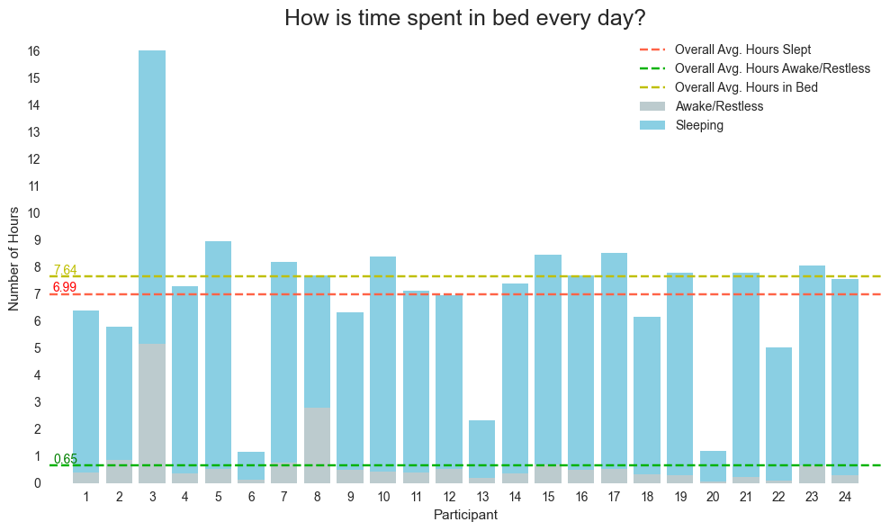
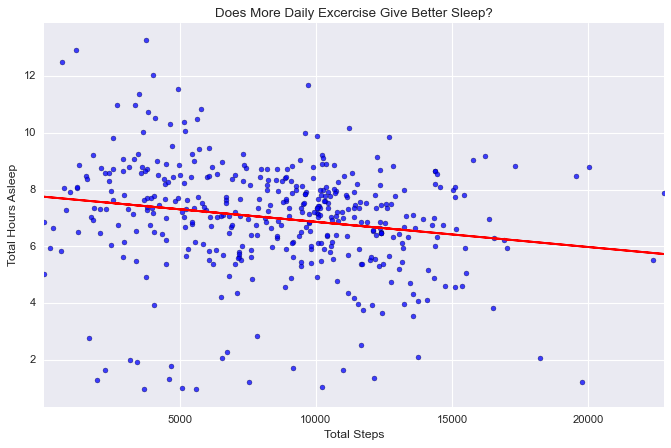
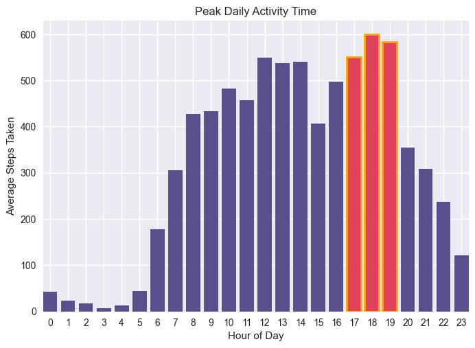
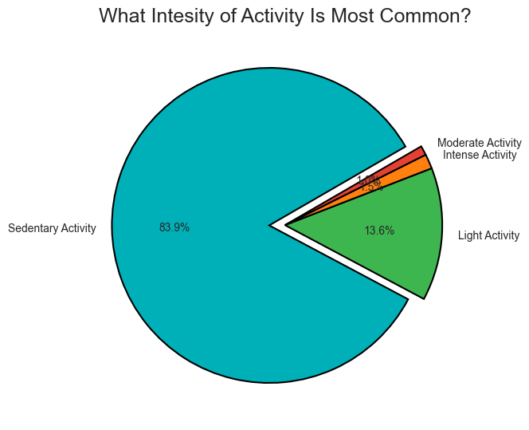
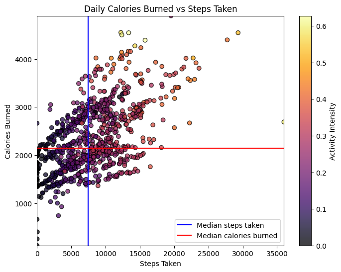

# Bellabeat: How Can A Wellness Technology Company Play It Smart?

**Note**: The complete jupyter notebook including the detailed code can be found at [Bellabeat Project.ipynb](https://github.com/ataunque/bellabeat_analysis/blob/main/Bellabeat%20Project.ipynb)

# STEP 1: ASK

#### 1.0 Background
Bellabeat, established in 2013 by Urška Sršen and Sando Mur, is a high-tech company specializing in health-focused smart products designed to empower women with insights into their health and habits. The company rapidly expanded its global presence, offering a range of wellness devices while emphasizing digital marketing strategies. Recognizing untapped potential, Bellabeat's co-founder, Urška Sršen, has tasked the marketing analytics team with analyzing non-Bellebeat smart device usage data to inform high-level marketing recommendations and spur further growth.

#### 1.2 Business Task:
<span style="color:#FFD700;">
Analyze health trend insights from FitBit wearable devices to refine Bellabeat's marketing strategy and drive product innovation, ultimately enhancing company growth and market competitiveness.
</span>

#### 1.3 Business Objectives:  
1. What are the health and wearable usage trends identified?
2. How could these trends apply to Bellabeat customers?
3. How could these trends help influence Bellabeat marketing strategy?

#### 1.4 Deliverables:
1. A clear summary of the business task
2. A description of all data sources used
3. Documentation of any cleaning or manipulation of data
4. A summary of analysis
5. Supporting visualizations and key findings
6. High-level content recommendations based on the analysis

#### 1.5 Key Stakeholders:
1. Urška Sršen: Bellabeat’s cofounder and Chief Creative Officer
2. Sando Mur: Mathematician, Bellabeat’s cofounder and key member of the Bellabeat executive team
3. Bellabeat marketing analytics team: A team of data analysts guiding Bellabeat's marketing strategy.

# STEP 2: PREPARE

#### 2.1 Information on Data Source:
1. The data is publicly available on [Kaggle: FitBit Fitness Tracker Data](https://www.kaggle.com/arashnic/fitbit) and stored in 18 csv files. 
2. Generated by respondents from a distributed survey via Amazon Mechanical Turk between 12 March 2016 to 12 May 2016.
3. 30 FitBit users who consented to the submission of personal tracker data.
4. Data collected includes (1) physical activity recorded in minutes, (2) heart rate, (3) sleep monitoring, (4) daily activity, and (5) steps.
5. Metadata can be found at [Metadata: FitBit Fitness Tracker Data](https://www.fitabase.com/media/1930/fitabasedatadictionary102320.pdf)
     
#### 2.2 Limitations of Data Set:
1. The data set comprises responses from only 30 individuals, without any accompanying demographic information such as gender, age, health conditions, or lifestyle details. Health trends are known to be heavily influenced by these factors, and the absence of such background information can lead to an incomplete and potentially biased analysis of the data.
2. The data was collected in the year 2016, which raises concerns about its current relevance. Lifestyle factors, including daily activities, fitness routines, sleep patterns, and dietary preferences, can change significantly over time. Consequently, the data may not accurately reflect the current health landscape.
3. The data collection methodology relies on surveys, which may raise questions about the precision and reliability of responses. Additionally, certain data points are self-reported, further complicating our assessment of data accuracy and reliability.
4. The Metadata lacks details and explanation of criteria used to label activity intensity. 

#### 2.3 Is Data ROCCC?
A good data source is ROCCC which stands for **R**eliable, **O**riginal, **C**omprehensive, **C**urrent, and **C**ited.
1. Reliable - LOW - Not reliable as it only has 30 respondents. Also, after exploring the data we see that these respondents don't provide complete data.
2. Original - LOW - Third-party provider (Amazon Mechanical Turk)
3. Comprehensive - MED - Parameters match most of Bellabeat's products' parameters
4. Current - LOW - Data is 7 years old and is not relevant
5. Cited - LOW - Data collected from third party, hence unknown

Overall, this dataset is considered of poor quality, and it is not recommended to base business recommendations on it due to its limited reliability, originality, and current relevance.

#### 2.4 Data Selection:
The following files are selected and downloaded for analysis:
- ```dailyActivity_merged.csv```
- ```hourlySteps_merged.csv```
- ```minuteIntensitiesNarrow_merged.csv```
- ```minuteCaloriesNarrow_merged.csv```
- ```sleepDay_merged.csv```

# STEP 3: PROCESS
Processed and cleaned the data using Python and libraries such as **numPy, pandas, and datetime**. For detailed code and data exploration, please refer to the Jupyter Notebook at ```Bellabeat Project.ipynb```.

# STEP 4: ANALYZE + STEP 5: SHARE

Perform calculations, create visualizations, and communicate our findings based on our analysis.

### **Sleep Trends**



**How is time spent in bed each day (Sleep Efficiency)?**

On average, Fitbit users spend 7.64 hours in bed each day, with 7 hours dedicated to sleep each night. Additionally, they experience approximately 40 minutes of wakefulness or restlessness while in bed.




**Does More Daily Exercise Give Better Sleep?**

Surprisingly, contrary to scientific studies, we find a very weak negative correlation. This suggests that as users engage in more daily exercise (measured by steps), they tend to sleep for fewer hours. We cannot establish if the more steps one takes will assure a good sleep session for a user. Given that we don't have a large sample size or any demographic information for the Fitbit users, this may be evidence of the data quality providing poor insights.

### **Exercise Trends**



**Most active time of day (hour) and least active time of day?**

The peak hours for physical activity typically occur between 5 PM and 7 PM, which coincides with the end of the traditional workday when people have more time for exercise. Conversely, there is a decrease in activity levels around 3 PM, possibly due to the post-lunch energy dip. Interestingly, activity levels start to rise around 6 AM, indicating that most participants are awake and potentially starting their day. However, between 6 AM and 8 AM, there is a relative decrease in the number of steps taken, suggesting that exercise is not a common part of the morning routines for many individuals. The majority of daily physical activity tends to take place between 7 AM and 11 PM, which corresponds to the average time spent in bed duration of around 7.64 hours noted earlier.



**Which intensity of activity is most common?**

The majority of the recorded activity, accounting for 83.9%, falls within the sedentary category, followed by light activity at 13.6%. This distribution aligns with the nature of step measurement, as most steps are taken for routine tasks and daily activities. However, what stands out is that both moderate and intense activities each constitute less than 2% of the recorded activity. This suggests that a significant portion of users may not be actively engaging in rigorous exercise or may not be primarily using their wearables for tracking fitness goals. Instead, they may be using these wearables more for visualizing their daily activity patterns, including steps taken during routine tasks and light activities.



**Calories burned vs. Steps taken**

There is a clear positive correlation between the number of steps taken and the calories burned by a user. In simple terms, as users take more steps, they burn more calories. We observed that the intensity of calories burned increases within a specific range of steps, notably from 0 to 15,000 steps. Beyond 15,000 steps, the calorie burn rate tends to level off or decrease. This suggests that there might be an optimal range for calorie burn efficiency during physical activity. During our analysis, we identified a few outliers in the data: 1. Instances where zero steps were recorded, calories were still being burned above the median calories. 2. In one observation, a user took over 35,000 steps but burned less than 3,000 calories. These outliers could be attributed to various factors, including natural data variation, changes in a user's activity pattern, or potential errors in data collection such as miscalculations, data contamination, or human error.


**Overall Average Steps Walked Daily**

On average, users logged 7,637 steps or 5.4km which is below the recommendation. As recommended by CDC, an adult has to aim at least 10,000 steps or 8km per day to benefit from general health, weight loss, and fitness improvement. [Source: Medical News Today article](https://www.medicalnewstoday.com/articles/how-many-steps-should-you-take-a-day)

# STEP 6: ACT
Based on the health trends identified, these are the recommendations we would make to guide the marketing strategy of the Leaf, Time, and Spring product lines:

## Sleep Efficiency Insights:
- Given the finding that users spend 40 minutes awake or restless whilst in bed each day, consider marketing sleep-related features. Promote sleep tracking, personalized sleep recommendations, or relaxation techniques within the app to help users improve sleep quality.
- Enhance the sleep tracking functionality to provide more detailed insights into sleep patterns and disturbances. Provide users with actionable tips to reduce wakefulness and restlessness, such as adjusting bedtime routines or environment.
- Detecting if a user is awake in bed and reminding them to go to sleep may allow more time towards sleep.
- Address the weak negative correlation between daily exercise (steps) and sleep hours cautiously. Instead of discouraging exercise, emphasize the importance of balancing physical activity with adequate sleep for overall health. Use this finding to educate users about the importance of rest and recovery. Consider adding features that help users find an optimal balance between exercise and sleep. For instance, provide guidance on setting workout schedules that align with their sleep patterns.

## Exercise Insights:
- Leverage the information about peak activity hours (5 PM to 7 PM) to encourage users to engage in physical activity during this period. Promote fitness challenges or group activities during these hours.
- Introduce reminders or notifications within the app to encourage users to stay active during the afternoon energy dip (around 3 PM).
- Provide morning workout routines to cater to users who prefer to exercise in the morning and encourage others who may not have considered.
- Gamify and create challenges with leaderboards to encourage more intense exercise activities. People may want to engage in more intense activity if they feel a sense of accomplishment.
- Emphasize the positive correlation between steps and calories burned to motivate users to reach their daily step goals. Consider running promotions or
---
Project By: Amolvir